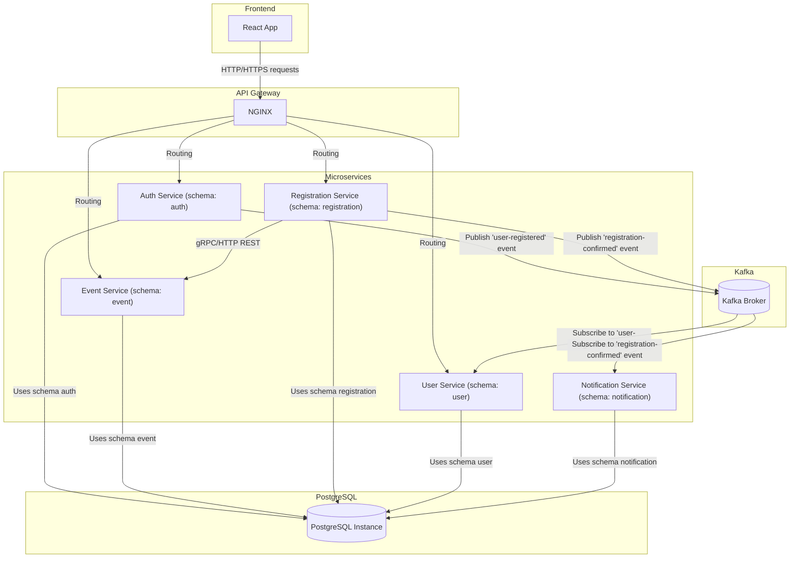
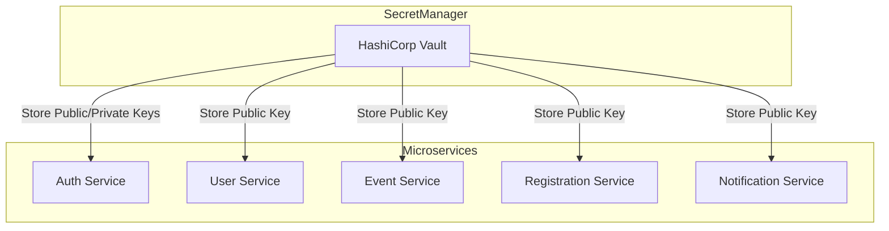

## Описание сервисов

### Auth Service
Auth service - сервис, отвечающий за безопасность, управление пользователями и их доступом. Он обеспечивает регистрацию пользователей, аутентификацию и авторизацию с использование JWT-токенов.

**Основные функции**:
- Регистрация пользователей: Принимает данные, валидирует их и создаёт новый аккаунт. Сохраняется хэш пароля.
- Аутентификая: при логине проверяет хэш пароля и имя или email. Если данные верны, генерирует jwt-токен.
- Выдача и проверка jwt-токенов: Токен используется для авторизации при обращении к другим сервисам. Он содержит информацию о пользователе, и его роли.
### User Service
Управляет даннными профиля пользователей. Хранит и обрабатывает информацию о пользователях, такую как их личные данные, настройки и историю активности.

**Основные фукнции:**
- Управление профилем: хранение информации о ползователях(имя, фото...)
- Настройки и предпочтения: Обработка настроек пользователя (например, уведомления)
- История активности: Слежение за действиями пользователя в системе(например история мероприятий)

### Event Service
Управляет созданием, редактированием, удаление и получением информации о мероприятиях. Отвечает за логику, связанную с меропрятиями, такими как место, время, описание и доступность.

**Основные функции**:
- Создание, редактирование, удаление мероприятий
- Получение информации о мероприятиях
- Проверка доступных мест

### Registration Service
управляет регистрацией пользователей на мероприятия, обрабатывает запросы на запись, проверяет доступность и сохраняет информацию о регистрации.

**Основные функции**
- Регистрация на мероприятие
- Подтверждение регистрации
- Публикация событий для Notification Service

### Notification Service
Отвечает за отправку уведомлений пользователям. Он подписывается на события, происходящие в других сервисах, и отправляет соответствующие уведомления.

**Основные фукнции**
- подписка на события в kafka
- отправка уведомлений пользователям

### Kafka
Используется для публикации уведомлений в Notification Service

### Postgres
Хранит данные всех сервисов на одном инстансе с разными схемами
mermaid graph:

## Управление ключами

