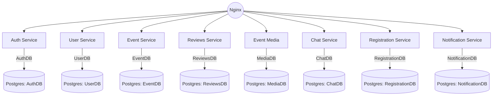
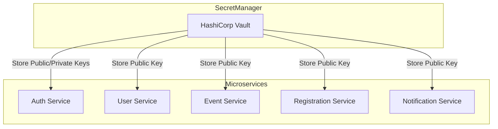

## Описание сервисов


- **Auth Service** — управляет пользователями, регистрацией и аутентификацией.
- **User Service** — хранит информацию о профиле пользователя и его активности.
- **Event Service** — управляет мероприятиями и их информацией.
- **Reviews Service** — управляет отзывами о мероприятиях.
- **Event Media Service**  — хранит медиафайлы, связанные с мероприятиями.
- **Chat Service** — обеспечивает чат для участников мероприятий.
- **Registration Service** — управляет регистрацией пользователей на мероприятия.
- **Notification Service** — управляет отправкой уведомлений(email/tg) о мероприятиях.

### Auth Service
Auth service - сервис, отвечающий за безопасность, управление пользователями и их доступом. Он обеспечивает регистрацию пользователей, аутентификацию и авторизацию с использование JWT-токенов.

#### api
GET /api/v1/auth/g
#### json
```json
{
    "username": "ivan",
    "passhash": "asdfhj87314gy8asdfh3478ysuadf",
    "email": "ivan@gmail.com"
}
```

#### golang
``` go
type User struct {
    ID        uint      `gorm:"primaryKey" json:"id"`
    Username  string    `gorm:"type:varchar(100);not null" json:"username"`
    Email     string    `gorm:"type:varchar(100);unique;not null" json:"email"`
    PassHash  string    `gorm:"type:varchar(255);not null" json:"pass_hash"`
    CreatedAt time.Time `gorm:"default:CURRENT_TIMESTAMP" json:"created_at"`
    UpdatedAt time.Time `gorm:"default:CURRENT_TIMESTAMP" json:"updated_at"`
}
```

**Основные функции**:
- Регистрация пользователей: Принимает данные, валидирует их и создаёт новый аккаунт. Сохраняется хэш пароля.
- Аутентификая: при логине проверяет хэш пароля и имя или email. Если данные верны, генерирует jwt-токен.
- Выдача и проверка jwt-токенов: Токен используется для авторизации при обращении к другим сервисам. Он содержит информацию о пользователе, и его роли.
### User Service
Управляет даннными профиля пользователей. Хранит и обрабатывает информацию о пользователях, такую как их личные данные, настройки и историю активности.

```go
type UserProfile struct {
    ID                   uint      `gorm:"primaryKey" json:"id"`
    Username             string    `gorm:"type:varchar(100);not null" json:"username"`
    Email                string    `gorm:"type:varchar(100);unique;not null" json:"email"`
    ProfilePicture       string    `gorm:"type:varchar(255)" json:"profile_picture"`
    NotificationsEnabled bool      `gorm:"default:true" json:"notifications_enabled"`
    CreatedAt            time.Time `gorm:"default:CURRENT_TIMESTAMP" json:"created_at"`
    UpdatedAt            time.Time `gorm:"default:CURRENT_TIMESTAMP" json:"updated_at"`
}

```

**Основные фукнции:**
- Управление профилем: хранение информации о ползователях(имя, фото...)
- Настройки и предпочтения: Обработка настроек пользователя (например, уведомления)
- История активности: Слежение за действиями пользователя в системе(например история мероприятий)

### Event Service
Управляет созданием, редактированием, удаление и получением информации о мероприятиях. Отвечает за логику, связанную с меропрятиями, такими как место, время, описание и доступность.
json:
```json
{
"name": "Баскетбол",
"description": "Играем баскет на улице",
"category": "Спорт",
"max_participants": 30,
"image_data": "iVBORw0KGgoAAAANSUhEUgAAA...",
"city": "Новосибирск",
"address": "Карла Маркса 37",
"latitude": 54.989688,
"longitude": 82.902014,
"start_time": "2025-05-15T17:00:00+07:00",
"end_time": "2025-05-15T23:00:00+07:00",
"status": "active",
"created_by": "evgeniyfimushkin"
}
```

golang:
```go
type Event struct {
    ID              uint      `gorm:"primaryKey" json:"id"`
    Name            string    `gorm:"type:varchar(255);not null;index" json:"name"`
    Description     string    `gorm:"type:text" json:"description"`
    Category        string    `gorm:"type:varchar(100);index" json:"category"`
    MaxParticipants int       `gorm:"default:100;check:max_participants >= 1" json:"max_participants"`
    // base64 image
    ImageData       []byte    `gorm:"type:bytea" json:"image_data"`

    City            string    `gorm:"type:varchar(100);not null;index" json:"city"`
    Address         string    `gorm:"type:varchar(255)" json:"address"`
    Latitude        float64   `gorm:"type:double precision;check:latitude >= -90 AND latitude <= 90" json:"latitude"`
    Longitude       float64   `gorm:"type:double precision;check:longitude >= -180 AND longitude <= 180" json:"longitude"`

    StartTime       time.Time `gorm:"not null;index" json:"start_time"`
    EndTime         time.Time `gorm:"not null;index" json:"end_time"`
    Status          string    `gorm:"type:varchar(50);not null;default:'active'" json:"status"`

    CreatedBy       string    `gorm:"not null;index" json:"created_by"`
    CreatedAt       time.Time `gorm:"autoCreateTime;default:CURRENT_TIMESTAMP" json:"created_at"`
    UpdatedAt       time.Time `gorm:"autoUpdateTime;default:CURRENT_TIMESTAMP" json:"updated_at"`
}

```


### Reviews Service

```go
type Review struct {
    ID        uint      `gorm:"primaryKey" json:"id"`
    EventID   uint      `gorm:"not null" json:"event_id"`
    UserID    uint      `gorm:"not null" json:"user_id"`
    Rating    int       `gorm:"not null;check:rating>=1 AND rating<=5" json:"rating"`
    Comment   string    `gorm:"type:text" json:"comment"`
    CreatedAt time.Time `gorm:"default:CURRENT_TIMESTAMP" json:"created_at"`
}
```
### EventMedia

```go
type EventMedia struct {
    ID        uint      `gorm:"primaryKey"`
    EventID   uint      `gorm:"not null"`
    MediaURL  string    `gorm:"type:varchar(255);not null"`
    MediaType string    `gorm:"type:varchar(50);not null"` // 'image', 'video', etc.
    UploadedAt time.Time `gorm:"default:CURRENT_TIMESTAMP"`
}

```
### Chat service

```go
type EventChat struct {
    ID        uint      `gorm:"primaryKey" json:"id"`
    EventID   uint      `gorm:"not null" json:"event_id"`
    CreatedAt time.Time `gorm:"default:CURRENT_TIMESTAMP" json:"created_at"`
}
```
``` go
type ChatMessage struct {
    ID          uint      `gorm:"primaryKey" json:"id"`
    ChatID      uint      `gorm:"not null" json:"chat_id"`
    UserID      uint      `gorm:"not null" json:"user_id"`
    Message     string    `gorm:"type:text" json:"message"`
    MessageType string    `gorm:"type:varchar(50);check:message_type IN ('text', 'media')" json:"message_type"`
    CreatedAt   time.Time `gorm:"default:CURRENT_TIMESTAMP" json:"created_at"`
}
```

```go
type WebSocketConnection struct {
    ID             uint      `gorm:"primaryKey" json:"id"`
    UserID         uint      `gorm:"not null" json:"user_id"`
    ConnectionID   string    `gorm:"type:varchar(255);unique;not null" json:"connection_id"`
    ChatID         uint      `gorm:"not null" json:"chat_id"`
    ConnectedAt    time.Time `gorm:"default:CURRENT_TIMESTAMP" json:"connected_at"`
    DisconnectedAt time.Time `json:"disconnected_at"`
}

```

### Registration Service
управляет регистрацией пользователей на мероприятия, обрабатывает запросы на запись, проверяет доступность и сохраняет информацию о регистрации.

```go
type EventRegistration struct {
    ID               uint      `gorm:"primaryKey" json:"id"`
    EventID          uint      `gorm:"not null" json:"event_id"`
    UserID           uint      `gorm:"not null" json:"user_id"`
    RegistrationTime time.Time `gorm:"default:CURRENT_TIMESTAMP" json:"registration_time"`
    Status           string    `gorm:"type:varchar(50);default:'registered'" json:"status"`
}

```
**Основные функции**
- Регистрация на мероприятие
- Подтверждение регистрации
- Публикация событий для Notification Service

### Notification Service
Отвечает за отправку уведомлений пользователям. Он подписывается на события, происходящие в других сервисах, и отправляет соответствующие уведомления.
```go
type Notification struct {
    ID               uint      `gorm:"primaryKey" json:"id"`
    UserID           uint      `gorm:"not null" json:"user_id"`
    EventID          uint      `gorm:"not null" json:"event_id"`
    Message          string    `gorm:"type:text;not null" json:"message"`
    SentAt           time.Time `gorm:"default:CURRENT_TIMESTAMP" json:"sent_at"`
    Status           string    `gorm:"type:varchar(50);default:'pending'" json:"status"`
    NotificationType string    `gorm:"type:varchar(50);not null" json:"notification_type"`
}
```
**Основные фукнции**
- подписка на события в kafka
- отправка уведомлений пользователям

### Kafka
Используется для публикации уведомлений в Notification Service

### Postgres
Хранит данные всех сервисов на одном инстансе с разными схемами
mermaid graph:



## Управление ключами





