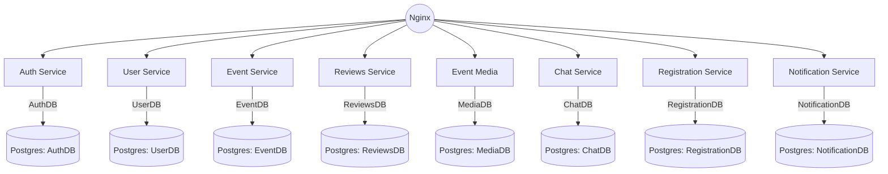
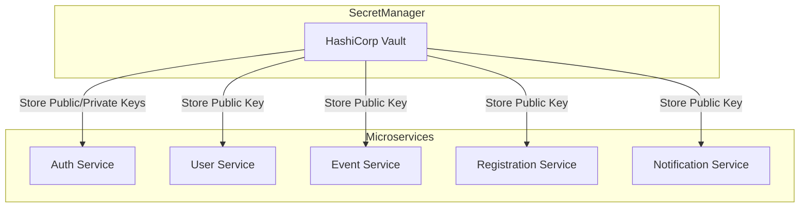

## Описание сервисов


---------------------------------------------------------------------------------------------------------------
## Архитектура и инфраструктура серверной части приложения

Серверная часть представляет собой микросервисное приложение со stateless бизнес сервисами и statefull сервисами, отвечающими за хранение данных.

Микросервисная архитектура - это архитектурное решение, при котором одно приложение разбивается на небольшие независимые сервисы, где каждый из них выполняет только одну конкретную задачу и взаимодействует с другими. Преимущества данного подхода: 


- Масштабируемость - возможность масшатирования отдельных сервисов в зависимости от нагрузки
- Гибкость - каждый сервис можно разрабатывать и обновлять отдельно, не влияя на систему
- Отказоустойчивость - сбой в одном сервисе не приводит к сбою всего приложения

Проблемы, которые необходимо решить при проектировании микросервисной архитектуры:
- Сложность управления - множество сервисов требуют оркестрации, настройкой логированния и авто-масштабирования
- Распределённые транзакции - операции, затрагивающие несколько сервисов нельзя обернуть в SQL-транзакцию. Необходим более сложное решение, как сага-паттерн или двухфазный коммит.
- Сетевые задержки - взаимодейтсвие сервисов по сети увеличивает время отклика всего приложения
- Повышенные затраты на инфраструктуру - необходима контейнеризация, оркестрация и балансировка нагрузки.
- Безопасность - необходима независимая система авторизации между сервисами и защита API

Golang выбран основным языком сервисов, ввиду его высокой производительности и эффективного использования вычислительных ресурсов. Go-компилятор генерирует машинный код, что обеспечивает минимальное время выполнения. Кроме того, язык обладает сборщиком мусора, упрощая управление памятью, а встроенный планировщик горутин позволяет реализовать высокопроизводительную асинхронную обработку запросов.


Формат взаимодействия между клиентом и сервером основан на JSON что обеспечивает удобство интеграции и совместимость с широким спектром технологий. 
Взаимодействие между микросервисами реализовано через gRPC протокол что использует бинарный протокол поверх HTTP/2, обеспечивая высокую скорость передачи данных и эффективное использование сетевых ресурсов.


Аутентификая производится путём JWT токенов. Преимущства JWT:
- Безопасность - JWT токен подписывается, что предотвращает его подделку
- Самодостаточность - токен содержит всю необходимую для авторизации информацию
- Масшибируемость - сервисы могут проверять токен без хранения сесиии
- Простота - токен передаётся в заголовке и хранится в куках


Сервисы и их задачи
1. Auth-service - регистрация, авторизация, выдача токенов.
2. User-service - управление пользовательскими аккаутами
3. Event-service - работа с сущностью мероприятий
4. Registration-service - работа с записями на мероприятие
5. Reviews-service - работа с отзывам на мероприятия
6. Notification-service - управление уведомлениями пользователей
7. Chat-service - управление чатами внутри мероприятия

Для разрешения проблем распределённых транзакций и асинхронности общения между сервисами используется брокер сообщений Kafka.


Для снижения нагрузки на базу данных, представлен кэш-сервис, который кэширует запросы в оперативной памяти и позволяет моментально отвечать на повторяющеися вызовы. Перед тем как идти в базу данных, каждый сервис проверяет кэш. В качестве кэша выбран Redis.


В качестве API Gateway сервиса исползуется nginx. При соединении с клиентом он использует SSL сертификат для безопасного общения по HTTPS. Nginx является proxy-сервером, который расшифровывает сообщения и передаёт их сервисам уже в виде HTTP.


## Мониторинг
Для поддержки и сопровождения приложения необхомо собирать и удобно ясно предоставлять информацию о приложении. Необходимо отслеживать логи и метрики каждого сервиса, и состояние сети в целом. 

Prometheus используется, как сборщик и хранилище временных метрки. Необходимые нам метрики это потребление ресурсов сервисами, скорость их ответа и их доступность. Стремясь к отказоусточивости важно быстро реагировать на критические ситуации, поэтому нам необходима система оповещений. Alert-manager - компонент prometheus, который получает и агрегирует алерты, при срабатывании заданных правил, отправляет уведомления в разные каналы: email, Telegram, и способен настроить расписание дежурства.

Логирование
Каждый сервис пишет логи в stdout, но запускаясь в контейнере, docker перехватывает логи, и направляет их в файл. Promtail читает логи из файла и отправляет в хранилище Loki, которое содержит в себе логи по временным меткам.


Визуализация
Grafana - мощный инструмент визуализации мониторинга систем. В качестве источников данных будет использовать Prometheus и Loki.


По итогу в нашей инфраструктуре будет два стэка контейнеров: стэк контейнеров приложения и стэк контейнеров мониторинга.


## Инфраструктура
#### CI\CD
CI/CD - непрерывная интеграция и развёртка, инструмент, благодаря которому создана среда автоматической сборки и тестирования приложения(CI) и среда автоматического развёртывания(CD). Такой подход значительно ускоряет и упрощает процесс разработки, процесс тестирования, и процесс развёртывания приложения. В качестве CI/CD интрумента выбраны Github Actions.


#### Управление и хранение секретов
Безопасное хранение и управление ключами являются важной частью инфраструктуры. Каждому сервису нужны необходимые ему секреты: приватные и публичные ключи, сертификаты, пароли и т.д. Для безопасности и прозрачности управления секретами необходимо централизированное хранилище секретов. В качестве инструмента управления и хранения секретами выбаран Github Actions.


#### Оркестрация
В основе инфраструктуры лежит Kubernetes Cluster, предоставляемый как PaaS сервис Yandex Cloud. Kuberneter обеспечивает автоматическое масштабирование, самовосстановление сервисов, предоставляет dns сервис и secret хранилище. Облачное решение позволяет оперативно управлять вычислительными ресурсами, оптимизировать и отслеживать затраты на работу сервиса.


-----------------------------------------------------------------------------------------------------------------


- **Auth Service** — управляет пользователями, регистрацией и аутентификацией.
- **User Service** — хранит информацию о профиле пользователя и его активности.
- **Event Service** — управляет мероприятиями и их информацией.
- **Reviews Service** — управляет отзывами о мероприятиях.
- **Event Media Service**  — хранит медиафайлы, связанные с мероприятиями.
- **Chat Service** — обеспечивает чат для участников мероприятий.
- **Registration Service** — управляет регистрацией пользователей на мероприятия.
- **Notification Service** — управляет отправкой уведомлений(email/tg) о мероприятиях.

### Auth Service
Auth service - сервис, отвечающий за безопасность, управление пользователями и их доступом. Он обеспечивает регистрацию пользователей, аутентификацию и авторизацию с использование JWT-токенов.

#### api
GET /api/v1/auth/g
#### json
```json
{
    "username": "ivan",
    "passhash": "asdfhj87314gy8asdfh3478ysuadf",
    "email": "ivan@gmail.com"
}
```

#### golang
``` go
type User struct {
    ID        uint      `gorm:"primaryKey" json:"id"`
    Username  string    `gorm:"type:varchar(100);not null" json:"username"`
    Email     string    `gorm:"type:varchar(100);unique;not null" json:"email"`
    PassHash  string    `gorm:"type:varchar(255);not null" json:"pass_hash"`
    CreatedAt time.Time `gorm:"default:CURRENT_TIMESTAMP" json:"created_at"`
    UpdatedAt time.Time `gorm:"default:CURRENT_TIMESTAMP" json:"updated_at"`
}
```

**Основные функции**:
- Регистрация пользователей: Принимает данные, валидирует их и создаёт новый аккаунт. Сохраняется хэш пароля.
- Аутентификая: при логине проверяет хэш пароля и имя или email. Если данные верны, генерирует jwt-токен.
- Выдача и проверка jwt-токенов: Токен используется для авторизации при обращении к другим сервисам. Он содержит информацию о пользователе, и его роли.
### User Service
Управляет даннными профиля пользователей. Хранит и обрабатывает информацию о пользователях, такую как их личные данные, настройки и историю активности.

```go
type UserProfile struct {
    ID                   uint      `gorm:"primaryKey" json:"id"`
    Username             string    `gorm:"type:varchar(100);not null" json:"username"`
    Email                string    `gorm:"type:varchar(100);unique;not null" json:"email"`
    ProfilePicture       string    `gorm:"type:varchar(255)" json:"profile_picture"`
    NotificationsEnabled bool      `gorm:"default:true" json:"notifications_enabled"`
    CreatedAt            time.Time `gorm:"default:CURRENT_TIMESTAMP" json:"created_at"`
    UpdatedAt            time.Time `gorm:"default:CURRENT_TIMESTAMP" json:"updated_at"`
}

```

**Основные фукнции:**
- Управление профилем: хранение информации о ползователях(имя, фото...)
- Настройки и предпочтения: Обработка настроек пользователя (например, уведомления)
- История активности: Слежение за действиями пользователя в системе(например история мероприятий)

### Event Service
Управляет созданием, редактированием, удаление и получением информации о мероприятиях. Отвечает за логику, связанную с меропрятиями, такими как место, время, описание и доступность.
json:
```json
{
"name": "Баскетбол",
"description": "Играем баскет на улице",
"category": "Спорт",
"max_participants": 30,
"image_data": "iVBORw0KGgoAAAANSUhEUgAAA...",
"city": "Новосибирск",
"address": "Карла Маркса 37",
"latitude": 54.989688,
"longitude": 82.902014,
"start_time": "2025-05-15T17:00:00+07:00",
"end_time": "2025-05-15T23:00:00+07:00",
"status": "active",
"created_by": "evgeniyfimushkin"
}
```

golang:
```go
type Event struct {
    ID              uint      `gorm:"primaryKey" json:"id"`
    Name            string    `gorm:"type:varchar(255);not null;index" json:"name"`
    Description     string    `gorm:"type:text" json:"description"`
    Category        string    `gorm:"type:varchar(100);index" json:"category"`
    MaxParticipants int       `gorm:"default:100;check:max_participants >= 1" json:"max_participants"`
    // base64 image
    ImageData       []byte    `gorm:"type:bytea" json:"image_data"`

    City            string    `gorm:"type:varchar(100);not null;index" json:"city"`
    Address         string    `gorm:"type:varchar(255)" json:"address"`
    Latitude        float64   `gorm:"type:double precision;check:latitude >= -90 AND latitude <= 90" json:"latitude"`
    Longitude       float64   `gorm:"type:double precision;check:longitude >= -180 AND longitude <= 180" json:"longitude"`

    StartTime       time.Time `gorm:"not null;index" json:"start_time"`
    EndTime         time.Time `gorm:"not null;index" json:"end_time"`
    Status          string    `gorm:"type:varchar(50);not null;default:'active'" json:"status"`

    CreatedBy       string    `gorm:"not null;index" json:"created_by"`
    CreatedAt       time.Time `gorm:"autoCreateTime;default:CURRENT_TIMESTAMP" json:"created_at"`
    UpdatedAt       time.Time `gorm:"autoUpdateTime;default:CURRENT_TIMESTAMP" json:"updated_at"`
}

```


### Reviews Service

```go
type Review struct {
    ID        uint      `gorm:"primaryKey" json:"id"`
    EventID   uint      `gorm:"not null" json:"event_id"`
    UserID    uint      `gorm:"not null" json:"user_id"`
    Rating    int       `gorm:"not null;check:rating>=1 AND rating<=5" json:"rating"`
    Comment   string    `gorm:"type:text" json:"comment"`
    CreatedAt time.Time `gorm:"default:CURRENT_TIMESTAMP" json:"created_at"`
}
```
### EventMedia

```go
type EventMedia struct {
    ID        uint      `gorm:"primaryKey"`
    EventID   uint      `gorm:"not null"`
    MediaURL  string    `gorm:"type:varchar(255);not null"`
    MediaType string    `gorm:"type:varchar(50);not null"` // 'image', 'video', etc.
    UploadedAt time.Time `gorm:"default:CURRENT_TIMESTAMP"`
}

```
### Chat service

```go
type EventChat struct {
    ID        uint      `gorm:"primaryKey" json:"id"`
    EventID   uint      `gorm:"not null" json:"event_id"`
    CreatedAt time.Time `gorm:"default:CURRENT_TIMESTAMP" json:"created_at"`
}
```
``` go
type ChatMessage struct {
    ID          uint      `gorm:"primaryKey" json:"id"`
    ChatID      uint      `gorm:"not null" json:"chat_id"`
    UserID      uint      `gorm:"not null" json:"user_id"`
    Message     string    `gorm:"type:text" json:"message"`
    MessageType string    `gorm:"type:varchar(50);check:message_type IN ('text', 'media')" json:"message_type"`
    CreatedAt   time.Time `gorm:"default:CURRENT_TIMESTAMP" json:"created_at"`
}
```

```go
type WebSocketConnection struct {
    ID             uint      `gorm:"primaryKey" json:"id"`
    UserID         uint      `gorm:"not null" json:"user_id"`
    ConnectionID   string    `gorm:"type:varchar(255);unique;not null" json:"connection_id"`
    ChatID         uint      `gorm:"not null" json:"chat_id"`
    ConnectedAt    time.Time `gorm:"default:CURRENT_TIMESTAMP" json:"connected_at"`
    DisconnectedAt time.Time `json:"disconnected_at"`
}

```

### Registration Service
управляет регистрацией пользователей на мероприятия, обрабатывает запросы на запись, проверяет доступность и сохраняет информацию о регистрации.

```go
type EventRegistration struct {
    ID               uint      `gorm:"primaryKey" json:"id"`
    EventID          uint      `gorm:"not null" json:"event_id"`
    UserID           uint      `gorm:"not null" json:"user_id"`
    RegistrationTime time.Time `gorm:"default:CURRENT_TIMESTAMP" json:"registration_time"`
    Status           string    `gorm:"type:varchar(50);default:'registered'" json:"status"`
}

```
**Основные функции**
- Регистрация на мероприятие
- Подтверждение регистрации
- Публикация событий для Notification Service

### Notification Service
Отвечает за отправку уведомлений пользователям. Он подписывается на события, происходящие в других сервисах, и отправляет соответствующие уведомления.
```go
type Notification struct {
    ID               uint      `gorm:"primaryKey" json:"id"`
    UserID           uint      `gorm:"not null" json:"user_id"`
    EventID          uint      `gorm:"not null" json:"event_id"`
    Message          string    `gorm:"type:text;not null" json:"message"`
    SentAt           time.Time `gorm:"default:CURRENT_TIMESTAMP" json:"sent_at"`
    Status           string    `gorm:"type:varchar(50);default:'pending'" json:"status"`
    NotificationType string    `gorm:"type:varchar(50);not null" json:"notification_type"`
}
```
**Основные фукнции**
- подписка на события в kafka
- отправка уведомлений пользователям

### Kafka
Используется для публикации уведомлений в Notification Service

### Postgres
Хранит данные всех сервисов на одном инстансе с разными схемами
mermaid graph:


``` mermaid
flowchart TB

Nginx((Nginx)) --> AuthService[Auth Service]

AuthService -->|AuthDB| AuthDB[(Postgres: AuthDB)]

Nginx --> UserService[User Service]

UserService -->|UserDB| UserDB[(Postgres: UserDB)]

Nginx --> EventService[Event Service]

EventService -->|EventDB| EventDB[(Postgres: EventDB)]

Nginx --> ReviewsService[Reviews Service]

ReviewsService -->|ReviewsDB| ReviewsDB[(Postgres: ReviewsDB)]

Nginx --> EventMedia[Event Media]

EventMedia -->|MediaDB| MediaDB[(Postgres: MediaDB)]

Nginx --> ChatService[Chat Service]

ChatService -->|ChatDB| ChatDB[(Postgres: ChatDB)]

Nginx --> RegistrationService[Registration Service]

RegistrationService -->|RegistrationDB| RegistrationDB[(Postgres: RegistrationDB)]

Nginx --> NotificationService[Notification Service]

NotificationService -->|NotificationDB| NotificationDB[(Postgres: NotificationDB)]
```

## Управление ключами



```mermaid
flowchart TD

subgraph Microservices

A["Auth Service"]

B["User Service"]

C["Event Service"]

D["Registration Service"]

E["Notification Service"]

end

  

subgraph SecretManager

F[HashiCorp Vault]

end

  

F -->|Store Public/Private Keys| A

F -->|Store Public Key| B

F -->|Store Public Key| C

F -->|Store Public Key| D

F -->|Store Public Key| E
```


