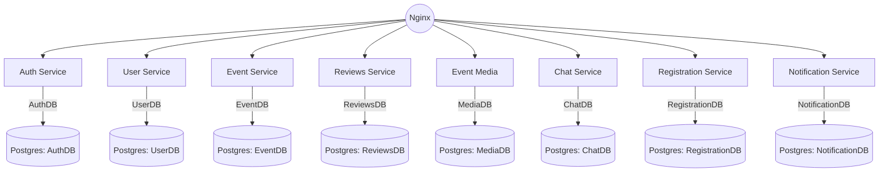
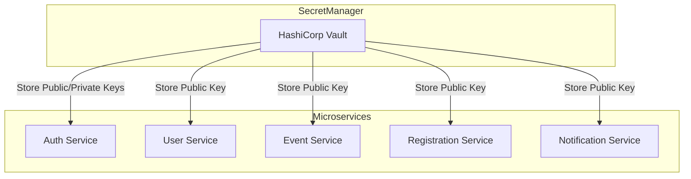

## Описание сервисов


- **Auth Service** — управляет пользователями, регистрацией и аутентификацией.
- **User Service** — хранит информацию о профиле пользователя и его активности.
- **Event Service** — управляет мероприятиями и их информацией.
- **Reviews Service** — управляет отзывами о мероприятиях.
- **Event Media Service**  — хранит медиафайлы, связанные с мероприятиями.
- **Chat Service** — обеспечивает чат для участников мероприятий.
- **Registration Service** — управляет регистрацией пользователей на мероприятия.
- **Notification Service** — управляет отправкой уведомлений(email/tg) о мероприятиях.

### Auth Service
Auth service - сервис, отвечающий за безопасность, управление пользователями и их доступом. Он обеспечивает регистрацию пользователей, аутентификацию и авторизацию с использование JWT-токенов.
``` go
type User struct {
    ID        uint      `gorm:"primaryKey"`
    Username  string    `gorm:"type:varchar(100);not null"`
    Email     string    `gorm:"type:varchar(100);unique;not null"`
    CreatedAt time.Time `gorm:"default:CURRENT_TIMESTAMP"`
    UpdatedAt time.Time `gorm:"default:CURRENT_TIMESTAMP"`
}

```
users:
- id
- username
- email
- pass_hash

**Основные функции**:
- Регистрация пользователей: Принимает данные, валидирует их и создаёт новый аккаунт. Сохраняется хэш пароля.
- Аутентификая: при логине проверяет хэш пароля и имя или email. Если данные верны, генерирует jwt-токен.
- Выдача и проверка jwt-токенов: Токен используется для авторизации при обращении к другим сервисам. Он содержит информацию о пользователе, и его роли.
### User Service
Управляет даннными профиля пользователей. Хранит и обрабатывает информацию о пользователях, такую как их личные данные, настройки и историю активности.

users:
- id
- username
- email
```go
type UserProfile struct {
    ID            uint      `gorm:"primaryKey"`
    Username      string    `gorm:"type:varchar(100);not null"`
    Email         string    `gorm:"type:varchar(100);unique;not null"`
    ProfilePicture string   `gorm:"type:varchar(255)"` // URL к изображению профиля
    NotificationsEnabled bool `gorm:"default:true"`
    CreatedAt     time.Time `gorm:"default:CURRENT_TIMESTAMP"`
    UpdatedAt     time.Time `gorm:"default:CURRENT_TIMESTAMP"`
}

```

**Основные фукнции:**
- Управление профилем: хранение информации о ползователях(имя, фото...)
- Настройки и предпочтения: Обработка настроек пользователя (например, уведомления)
- История активности: Слежение за действиями пользователя в системе(например история мероприятий)

### Event Service
Управляет созданием, редактированием, удаление и получением информации о мероприятиях. Отвечает за логику, связанную с меропрятиями, такими как место, время, описание и доступность.

Поля тиблицы events:
- id
- name
- desctiption
- category
- image_path
- location
- start_time
- end_time
- max_participants
- created_by - id организатора
- created_at
- updated_at
- status - активно, завершено, отменено

Поля таблицы Locations:
- id
- city
- address 
- latitude - широта
- longitude - долгота

```go
type Event struct {
    ID               uint      `gorm:"primaryKey"`
    Name             string    `gorm:"type:varchar(255);not null"`
    Description      string    `gorm:"type:text"`
    Category         string    `gorm:"type:varchar(100)"`
    ImagePath        string    `gorm:"type:varchar(255)"`
    Location         string    `gorm:"type:varchar(255)"`
    StartTime        time.Time `gorm:"not null"`
    EndTime          time.Time
    MaxParticipants  int       `gorm:"default:100"`
    CreatedBy        uint      `gorm:"not null"`
    CreatedAt        time.Time `gorm:"default:CURRENT_TIMESTAMP"`
    UpdatedAt        time.Time `gorm:"default:CURRENT_TIMESTAMP"`
    Status           string    `gorm:"type:varchar(50);default:'active'"` // 'active', 'completed', 'cancelled'
}

```

```go
type Location struct {
    ID        uint      `gorm:"primaryKey"`
    City      string    `gorm:"type:varchar(100);not null"`
    Address   string    `gorm:"type:varchar(255)"`
    Latitude  float64   `gorm:"type:double"`
    Longitude float64   `gorm:"type:double"`
    CreatedAt time.Time `gorm:"default:CURRENT_TIMESTAMP"`
    UpdatedAt time.Time `gorm:"default:CURRENT_TIMESTAMP"`
}

```
**Основные функции**:
- Создание, редактирование, удаление мероприятий
- Получение информации о мероприятиях
- Проверка доступных мест

### Reviews Service

Поля табрицы reviews:
- id
- event_id
- user_id
- rating
- comment
- created_at
```go
type Review struct {
    ID        uint      `gorm:"primaryKey"`
    EventID   uint      `gorm:"not null"`
    UserID    uint      `gorm:"not null"`
    Rating    int       `gorm:"not null;check:rating>=1 AND rating<=5"` // Оценка от 1 до 5
    Comment   string    `gorm:"type:text"`
    CreatedAt time.Time `gorm:"default:CURRENT_TIMESTAMP"`
}

```
### EventMedia

table event_media:
- id
- event_id
- media_url
- media_type
- uploaded_at
```go
type EventMedia struct {
    ID        uint      `gorm:"primaryKey"`
    EventID   uint      `gorm:"not null"`
    MediaURL  string    `gorm:"type:varchar(255);not null"`
    MediaType string    `gorm:"type:varchar(50);not null"` // 'image', 'video', etc.
    UploadedAt time.Time `gorm:"default:CURRENT_TIMESTAMP"`
}

```
### Chat service
event_chat:
- id
- event_id
- created_at
```go
type EventChat struct {
    ID        uint      `gorm:"primaryKey"`
    EventID   uint      `gorm:"not null"`
    CreatedAt time.Time `gorm:"default:CURRENT_TIMESTAMP"`
}

```
chat_messages:
- id
- chat_id
- user_id
- message
- message_type
- created_at
``` go
type ChatMessage struct {
    ID        uint      `gorm:"primaryKey"`
    ChatID    uint      `gorm:"not null"`
    UserID    uint      `gorm:"not null"`
    Message   string    `gorm:"type:text"`
    MessageType string  `gorm:"type:varchar(50);check:message_type IN ('text', 'media')"`
    CreatedAt time.Time `gorm:"default:CURRENT_TIMESTAMP"`
}

```
websocket_connection:
- id
- user_id
- connection_id
- chat_id
- connected_at
- disconnected_at

```go
type WebSocketConnection struct {
    ID            uint      `gorm:"primaryKey"`
    UserID        uint      `gorm:"not null"`
    ConnectionID  string    `gorm:"type:varchar(255);unique;not null"`
    ChatID        uint      `gorm:"not null"`
    ConnectedAt   time.Time `gorm:"default:CURRENT_TIMESTAMP"`
    DisconnectedAt time.Time
}

```

### Registration Service
управляет регистрацией пользователей на мероприятия, обрабатывает запросы на запись, проверяет доступность и сохраняет информацию о регистрации.

Поля БД:
- id
- event_id
- user_id
- registration_time
- status
```go
type EventRegistration struct {
    ID               uint      `gorm:"primaryKey"`
    EventID          uint      `gorm:"not null"`
    UserID           uint      `gorm:"not null"`
    RegistrationTime time.Time `gorm:"default:CURRENT_TIMESTAMP"`
    Status           string    `gorm:"type:varchar(50);default:'registered'"` // 'registered', 'cancelled', 'no_show'
}
```
**Основные функции**
- Регистрация на мероприятие
- Подтверждение регистрации
- Публикация событий для Notification Service

### Notification Service
Отвечает за отправку уведомлений пользователям. Он подписывается на события, происходящие в других сервисах, и отправляет соответствующие уведомления.
```go
type Notification struct {
    ID          uint      `gorm:"primaryKey"`
    UserID      uint      `gorm:"not null"` 
    EventID     uint      `gorm:"not null"` 
    Message     string    `gorm:"type:text;not null"`
    SentAt      time.Time `gorm:"default:CURRENT_TIMESTAMP"` 
    Status      string    `gorm:"type:varchar(50);default:'pending'"` // Статус: 'pending', 'sent', 'failed'
    NotificationType string `gorm:"type:varchar(50);not null"` // Тип уведомления: 'email', 'telegram'
}

```
**Основные фукнции**
- подписка на события в kafka
- отправка уведомлений пользователям

### Kafka
Используется для публикации уведомлений в Notification Service

### Postgres
Хранит данные всех сервисов на одном инстансе с разными схемами
mermaid graph:



## Управление ключами





